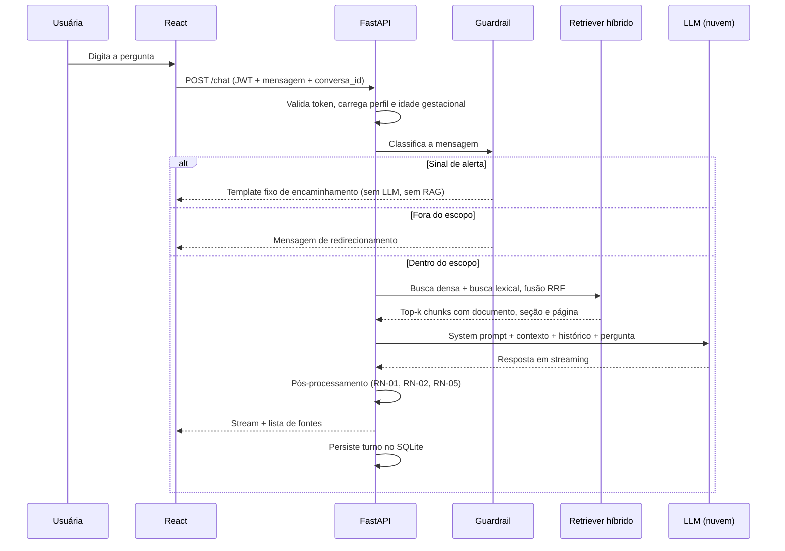
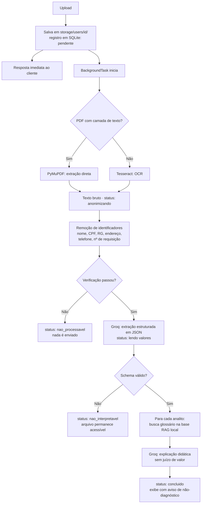

# MaterAI — Documento de Escopo e Arquitetura

**Trabalho de Conclusão de Curso**
Andrei Fernandes Kwok · Daiane Batista da Silva · Kaique Batista Ramos
São Paulo — 2026

**Versão:** 2.2 — execução local, inferência em nuvem com anonimização prévia e chave paga como salvaguarda
**Status:** Base para desenvolvimento
**Documento de referência:** Artigo de qualificação — *MaterAI*

### Mudanças em relação à v1.0

| Item | v1.0 | v2.1 | Motivo |
|---|---|---|---|
| Persistência | Firebase (Auth + Firestore + Storage) | SQLite + JWT + disco local | Cloud Storage passou a exigir plano pago; execução local dispensa serviço externo |
| Arquivos das usuárias | Firebase Storage | Sistema de arquivos local | Custo zero; o arquivo original nunca sai da máquina |
| Recuperação (RAG) | Embeddings semânticos (proposto) | Híbrido: denso + TF-IDF existente | Auditoria do corpus revelou que a coleção atual é apenas lexical |
| Provedor de LLM | API GPT | Groq (free tier) como padrão, OpenAI paga como salvaguarda e linha de base | Hardware da equipe não comporta modelo local; Groq tem política de não-treinamento e a chave paga garante a demonstração |
| Proteção de dado sensível | Processamento local | **Anonimização obrigatória antes do envio** | Sem modelo local, a barreira de privacidade passa a ser a remoção de identificadores |
| Processamento de documentos | Assíncrono com fila | `BackgroundTasks` + progresso via SSE | Simplicidade com boa responsividade |

---

## 1. Visão geral

O MaterAI é uma aplicação web que oferece apoio informacional a gestantes e mães por meio de um agente conversacional baseado em modelos de linguagem, ancorado em uma base de conhecimento própria construída a partir de 65 documentos oficiais de saúde materno-infantil.

Além do chat, a aplicação oferece uma área pessoal onde a usuária organiza seus **exames**, **documentos** e **receitas médicas**, com apoio da IA para *leitura e explicação* do conteúdo — sem emissão de diagnóstico.

O protótipo é executado localmente, nas máquinas da equipe: aplicação, banco de dados e arquivos das usuárias permanecem no computador. A inferência dos modelos de linguagem é o único componente em nuvem, e o conteúdo enviado a ela passa obrigatoriamente por uma camada de anonimização (seção 7.4).

### 1.1 Proposta de valor

| Problema | Como o MaterAI responde |
|---|---|
| Informação sobre gestação é dispersa e de confiabilidade variável | Respostas geradas com RAG sobre 65 documentos oficiais, com citação de documento e página |
| Dúvidas variam conforme a semana gestacional | Personalização pelo perfil e pela idade gestacional |
| Exames chegam em linguagem técnica e a consulta é curta | Extração dos valores e explicação de cada termo em linguagem acessível |
| Documentos do pré-natal ficam soltos em papel e fotos no celular | Repositório organizado por categoria, com agenda de consultas |

### 1.2 O que o MaterAI **não** é

Esta delimitação é parte do escopo e deve aparecer também na interface.

- Não é serviço médico e não substitui pré-natal, consulta ou atendimento de urgência.
- Não emite diagnóstico, hipótese diagnóstica, prognóstico ou conduta terapêutica.
- Não prescreve, ajusta ou sugere medicamentos, dosagens ou suplementos.
- Não faz triagem de risco nem classificação de gravidade.
- Não é serviço de apoio psicológico ou de crise.

---

## 2. Escopo

### 2.1 Dentro do escopo

1. Cadastro e autenticação local da usuária.
2. Perfil da gestante/mãe, preenchido no primeiro acesso.
3. Chat conversacional com RAG híbrido sobre a base de conhecimento.
4. Três áreas de arquivos: Exames, Documentação e Receitas Médicas.
5. Leitura assistida por IA dos arquivos: extração de valores e explicação de termos.
6. Calendário com agendamento manual de consultas e exames.
7. Histórico de conversas por usuária.
8. Testes de usabilidade e de qualidade de recuperação.

### 2.2 Fora do escopo (trabalhos futuros)

- Diagnóstico, conduta clínica ou triagem de risco automatizada.
- Integração com prontuário eletrônico, laboratórios ou sistemas do SUS.
- Aplicativo mobile nativo (a web será responsiva).
- Notificações push, SMS ou WhatsApp.
- Deploy em produção com múltiplas usuárias simultâneas.
- Telemedicina ou chat com profissional humano.
- Múltiplos idiomas; perfil para profissional de saúde ou acompanhante.

### 2.3 Escopo temático do agente

Desenvolvimento fetal por semana gestacional, sintomas comuns da gravidez, alimentação e nutrição, cuidados pré-natais e rotina de exames, sinais de alerta, preparo para o parto, pós-parto inicial e amamentação, e acolhimento emocional com incentivo à busca de acompanhamento profissional.

---

## 3. Usuária e perfil

### 3.1 Persona principal

Mulher gestante ou puérpera, com acesso a smartphone ou computador, letramento digital básico, em acompanhamento pré-natal, que busca entender melhor o que acontece com seu corpo e com o bebê entre uma consulta e outra.

### 3.2 Campos do cadastro

| Campo | Tipo | Obrigatório | Uso no sistema |
|---|---|---|---|
| Nome completo | texto | sim | Personalização do tratamento |
| Data de nascimento | data | sim | Faixa etária influencia orientações |
| Estado civil | seleção | não | Contexto de rede de apoio |
| Situação | gestante / puérpera / tentante | sim | Define conteúdos relevantes |
| Data da última menstruação (DUM) | data | condicional | Cálculo da idade gestacional |
| Data provável do parto (DPP) | data | condicional | Alternativa à DUM |
| Gestações anteriores | número | não | Ajuste de linguagem (primigesta x multípara) |
| Cidade/UF | texto | não | Referência a serviços públicos regionais |
| Aceite dos termos | booleano | sim | Base legal para tratamento de dados |
| Consentimento para dados de saúde | booleano | sim (para as abas de arquivos) | LGPD, art. 11 |

> A idade gestacional é derivada de DUM ou DPP, recalculada a cada acesso e injetada no contexto do agente em toda conversa.

---

## 4. Requisitos funcionais

### 4.1 Conta e perfil

| ID | Requisito | Prioridade |
|---|---|---|
| RF-01 | Cadastro por e-mail e senha, com hash bcrypt | Alta |
| RF-02 | Login e logout com token JWT | Alta |
| RF-03 | Recuperação de senha (redefinição local pelo administrador no protótipo) | Baixa |
| RF-04 | Preenchimento do perfil no primeiro acesso | Alta |
| RF-05 | Edição do perfil | Média |
| RF-06 | Cálculo automático da idade gestacional | Alta |
| RF-07 | Exclusão da conta e de todos os dados e arquivos associados | Alta |

### 4.2 Chat

| ID | Requisito | Prioridade |
|---|---|---|
| RF-08 | Enviar pergunta em linguagem natural e receber resposta | Alta |
| RF-09 | Resposta gerada com RAG sobre a base de conhecimento | Alta |
| RF-10 | Exibir documento, seção e página de cada fonte usada | Alta |
| RF-11 | Considerar perfil e idade gestacional no contexto | Alta |
| RF-12 | Manter memória da conversa dentro da sessão | Alta |
| RF-13 | Persistir e listar o histórico de conversas | Média |
| RF-14 | Exibir resposta em streaming | Média |
| RF-15 | Recusar perguntas fora do escopo com mensagem orientativa | Alta |
| RF-16 | Detectar sinal de alerta e responder com template fixo de encaminhamento | Alta |
| RF-17 | Avaliação da resposta pela usuária (útil / não útil) | Média |

### 4.3 Exames, Documentação e Receitas

| ID | Requisito | Prioridade |
|---|---|---|
| RF-18 | Upload de arquivo (PDF, JPG, PNG) em uma das três categorias | Alta |
| RF-19 | Listar, visualizar, renomear e excluir arquivos | Alta |
| RF-20 | Extrair texto do arquivo, com OCR quando não houver camada de texto | Alta |
| RF-21 | Extrair de exames os pares analito/valor/unidade/faixa de referência | Alta |
| RF-22 | Explicar em linguagem acessível o que cada marcador significa | Alta |
| RF-23 | Exibir o valor da usuária ao lado da faixa de referência do próprio laudo | Alta |
| RF-24 | Permitir perguntar ao chat sobre um arquivo específico | Média |
| RF-25 | Exibir aviso fixo de não-diagnóstico em toda tela de exame | Alta |
| RF-26 | Registrar data do exame e ordenar cronologicamente | Média |
| RF-27 | Exibir progresso do processamento em tempo real | Média |
| RF-28 | Reprocessar documento com falha | Baixa |
| RF-29 | Remover identificadores pessoais do texto antes de qualquer envio a serviço externo | Alta |
| RF-30 | Registrar quantos identificadores foram removidos por documento, para auditoria | Média |
| RF-31 | Bloquear o envio e marcar o documento como não processável se a anonimização falhar | Alta |

### 4.4 Calendário

| ID | Requisito | Prioridade |
|---|---|---|
| RF-32 | Criar evento manual (consulta ou exame) com data, hora, título e local | Alta |
| RF-33 | Visualizar eventos em calendário mensal e em lista | Alta |
| RF-34 | Editar e excluir evento | Média |
| RF-35 | Vincular um arquivo enviado a um evento do calendário | Baixa |

---

## 5. Requisitos não funcionais

| ID | Requisito |
|---|---|
| RNF-01 | Interface responsiva, utilizável a partir de 360 px |
| RNF-02 | Primeira resposta do chat iniciada em até 5 s (percepção via streaming) |
| RNF-03 | Processamento de um exame concluído em até 45 s, incluindo OCR local e duas chamadas ao provedor |
| RNF-04 | Linguagem das respostas acessível, sem jargão não explicado |
| RNF-05 | Aplicação, banco, arquivos, embeddings e anonimização executados localmente; apenas a inferência do LLM é externa |
| RNF-06 | Dados de saúde tratados como dado pessoal sensível (LGPD, art. 5º, II) |
| RNF-07 | Arquivos acessíveis apenas pela usuária proprietária |
| RNF-08 | Toda resposta que cite conteúdo da base deve indicar documento, seção e página |
| RNF-09 | Código versionado em Git com README e instruções de execução |
| RNF-10 | Chaves de API fora do repositório, em variáveis de ambiente |
| RNF-11 | Logs sem conteúdo de mensagens nem dados de saúde |
| RNF-12 | Instalação completa em uma máquina nova em até 30 minutos, documentada |

---

## 6. Regras de negócio e limites de segurança

Refletidas no *system prompt*, na camada de pós-processamento e na interface.

| ID | Regra |
|---|---|
| RN-01 | O agente nunca afirma que a usuária tem ou não tem uma condição de saúde |
| RN-02 | O agente nunca sugere, ajusta ou desaconselha medicamento ou dosagem |
| RN-03 | Diante de sinal de alerta, o agente orienta procurar atendimento imediatamente e encerra a linha de raciocínio clínico |
| RN-04 | Na leitura de exames, apresenta apenas: analito, valor, unidade, faixa de referência do laudo e explicação do que o marcador mede |
| RN-05 | Não classifica resultado como "normal", "alterado", "bom" ou "ruim" |
| RN-06 | Se o conteúdo recuperado não sustentar a resposta, declara que não possui a informação |
| RN-07 | Toda tela com conteúdo de exame apresenta aviso de não-diagnóstico persistente |
| RN-08 | Em relato de sofrimento psíquico grave, acolhe e encaminha para CVV (188) e CAPS |
| RN-09 | Aceite dos termos e consentimento para dados de saúde são pré-requisito para as abas de arquivos |
| RN-10 | Nenhum texto extraído de documento da usuária é enviado a serviço externo sem passar pela anonimização |
| RN-11 | O consentimento informa explicitamente que o conteúdo anonimizado é processado por serviço no exterior |

### 6.1 Sinais de alerta (gatilho de RN-03)

Sangramento vaginal, perda de líquido, dor abdominal intensa e persistente, dor de cabeça forte que não cede, alterações visuais, inchaço súbito de rosto e mãos, febre, redução ou ausência de movimentação fetal, contrações regulares antes de 37 semanas, vômitos incoercíveis, desmaio, convulsão.

A detecção ocorre **antes** da recuperação e da geração. Em caso de gatilho, a resposta é um template fixo — não gerada pelo modelo.

> **Justificativa técnica:** a auditoria de recuperação (seção 10.2) mostrou que perguntas descrevendo sinais de alerta em linguagem coloquial recuperam contexto irrelevante. Colocar o classificador de alerta antes do RAG garante que esse caminho não dependa da qualidade da busca.

---

## 7. Arquitetura da solução

### 7.1 Visão em camadas

```
┌──────────────────────────────────────────────────────────────┐
│  CLIENTE — React (SPA) · localhost:5173                      │
│  Chat · Perfil · Exames · Documentação · Receitas · Agenda   │
└───────────────┬──────────────────────────────────────────────┘
                │ HTTP · Authorization: Bearer <JWT>
┌───────────────▼──────────────────────────────────────────────┐
│  API — Python / FastAPI · localhost:8000                     │
│  ├─ Auth (JWT + bcrypt)                                      │
│  ├─ /chat · /documents · /profile · /calendar                │
└───┬───────────────┬───────────────┬──────────────┬───────────┘
    │               │               │              │
┌───▼──────────┐ ┌──▼───────────┐ ┌─▼──────────┐ ┌─▼───────────┐
│ ORQUESTRAÇÃO │ │ PIPELINE DE  │ │ SQLite     │ │ ARQUIVOS    │
│ LangChain    │ │ DOCUMENTOS   │ │ app.db     │ │ ./storage/  │
│ ├ Guardrails │ │ ├ PyMuPDF    │ │ usuárias   │ │ users/{id}/ │
│ ├ Retriever  │ │ ├ Tesseract  │ │ conversas  │ │ (nunca sai  │
│ │  híbrido   │ │ ├ ANONIMIZA  │ │ documentos │ │  da máquina)│
│ ├ Prompt     │ │ ├ Extração   │ │ eventos    │ │             │
│ └ LLM Client │ │ └ Explicação │ │            │ │             │
└───┬──────────┘ └──────┬───────┘ └────────────┘ └─────────────┘
    │                   │
    ├───────────────┬───┴─────────────┐
┌───▼──────────┐ ┌──▼────────────┐ ┌──▼───────────────────────┐
│ ChromaDB     │ │ Índice TF-IDF │ │ LLM — Groq (nuvem)       │
│ denso        │ │ (lexical)     │ │ ├ chat: pergunta + RAG   │
│ maternidade_ │ │ existente     │ │ └ exames: texto JÁ       │
│ docs_v2      │ │               │ │    anonimizado           │
└──────────────┘ └───────────────┘ └──────────────────────────┘
      (embeddings gerados localmente, sem chamada externa)
```

**Fronteira de privacidade.** Sem modelo local disponível, a barreira deixa de ser "onde o processamento acontece" e passa a ser "o que é enviado". Três camadas sustentam isso:

1. **O arquivo original nunca sai da máquina.** O que trafega é texto extraído, nunca o PDF ou a imagem.
2. **Anonimização obrigatória** antes de qualquer chamada externa com conteúdo de documento (seção 7.4).
3. **Provedor com política de não-treinamento.** Groq, diferentemente de free tiers que se financiam com os prompts, declara não usar dados de API para treinar modelos. Esse é o principal motivo técnico para preferi-lo ao Gemini no processamento de exames — e deve constar do artigo como justificativa da escolha, não como detalhe de implementação.

### 7.2 Fluxo de uma pergunta no chat



### 7.3 Fluxo de leitura de um exame



> A extração estruturada e a explicação são **duas chamadas separadas** ao modelo. Separar reduz alucinação, permite validar o JSON antes de gerar texto e torna possível avaliar cada etapa isoladamente nos testes — o que rende dados objetivos para a seção de resultados.

### 7.4 Camada de anonimização

Deixou de ser trabalho futuro e passou a ser componente obrigatório do pipeline. Nenhum texto extraído de documento da usuária chega ao provedor externo sem passar por ela.

**O que é removido**, por regras determinísticas (regex), antes de qualquer chamada:

| Identificador | Estratégia | Substituto |
|---|---|---|
| Nome da paciente | Casamento com o nome do perfil, incluindo variações e ordem invertida | `[PACIENTE]` |
| CPF | Padrão numérico com validação de dígito verificador | `[CPF]` |
| RG, CNS, nº de requisição, protocolo | Padrões rotulados no laudo | `[ID]` |
| Data de nascimento | Casamento com a data do perfil | `[DATA_NASC]` |
| Telefone, e-mail, endereço, CEP | Padrão | `[CONTATO]` |
| Nome do médico e CRM | Padrão rotulado | `[PROFISSIONAL]` |
| Nome do laboratório | Lista + cabeçalho/rodapé | `[LABORATORIO]` |

O que permanece: nomes de analitos, valores, unidades, faixas de referência e a data do exame. Isolada dessa forma, a tabela de resultados não identifica ninguém.

**Verificação antes do envio** (RF-31): uma segunda passagem confere que o nome do perfil, o CPF e a data de nascimento não aparecem mais no texto. Se aparecerem, o envio é bloqueado e o documento fica com status `nao_processavel`. Falhar fechado, nunca aberto.

**Não use o LLM para anonimizar.** Seria circular: o texto precisaria ser enviado justamente para que se decidisse o que não enviar. A anonimização é determinística, roda local e é auditável.

> **Valor acadêmico:** meça a taxa de remoção de identificadores em um conjunto de laudos com PII conhecida. É uma métrica objetiva, com método claro, e responde antecipadamente à pergunta mais provável da banca sobre privacidade. Vale uma subseção própria nos resultados.

---

## 8. Stack tecnológica

| Camada | Tecnologia | Justificativa |
|---|---|---|
| Frontend | React 18 + Vite | SPA, ecossistema maduro, build rápido |
| Estilo | Tailwind CSS | Prototipação rápida e responsividade |
| Estado servidor | TanStack Query | Cache e sincronização com a API |
| Calendário | react-big-calendar | Componente pronto |
| Backend | Python 3.11 + FastAPI | Async nativo, Pydantic, OpenAPI automático |
| Autenticação | JWT (`python-jose`) + bcrypt (`passlib`) | Sem serviço externo, sem cartão, funciona offline |
| Banco de dados | SQLite + SQLAlchemy | Arquivo único, zero configuração, migrável para PostgreSQL |
| Migrações | Alembic | Evolução do schema versionada |
| Arquivos | Sistema de arquivos local (`./storage/`) | Custo zero, nenhum dado sai da máquina |
| Orquestração LLM | LangChain | Encadeamento, retrievers, integração com Chroma |
| LLM — padrão | Groq, via interface OpenAI-compatível | Free tier sem cartão, limites publicados, política de não-treinamento |
| LLM — salvaguarda | OpenAI (`gpt-4o-mini` ou equivalente), chave paga com crédito limitado | Garante a demonstração e serve de linha de base nos testes comparativos |
| Anonimização | Regex determinística + validação, local | Nenhum identificador sai da máquina |
| Embeddings | `intfloat/multilingual-e5-base` via sentence-transformers | Roda local em CPU (~280 MB), bom desempenho em PT-BR, gratuito |
| Base vetorial | ChromaDB persistente | Já em uso no projeto |
| Busca lexical | TF-IDF existente (`tfidf_vectorizer.joblib`) | Reaproveita o trabalho feito, compõe o híbrido |
| Extração de PDF | PyMuPDF (`fitz`) | Já usado na construção do corpus |
| OCR | Tesseract (`pytesseract`) | Gratuito, suficiente para laudos |
| Versionamento | Git + GitHub | Rastreabilidade |

### 8.1 Camada de LLM plugável

Groq e OpenAI expõem a mesma interface de API. Escrevendo o cliente contra ela, trocar de provedor é mudar variável de ambiente:

```
LLM_PROVIDER=groq                              # groq | openai
LLM_BASE_URL=https://api.groq.com/openai/v1
LLM_MODEL=...
LLM_API_KEY=...

# Salvaguarda — acionada por falha ou manualmente na demonstração
LLM_FALLBACK_PROVIDER=openai
LLM_FALLBACK_BASE_URL=https://api.openai.com/v1
LLM_FALLBACK_MODEL=gpt-4o-mini
LLM_FALLBACK_API_KEY=
```

Trocar de provedor é mudar variável de ambiente, sem alterar código — desde que o cliente seja escrito contra a interface OpenAI-compatível desde o início. Isso também permite **comparar os dois provedores nos testes**: uma tabela de qualidade por modelo é resultado direto para o artigo, e a OpenAI paga funciona bem como linha de base.

**Acionamento da salvaguarda.** O cliente tenta o provedor padrão e, diante de HTTP 429 (limite excedido), 5xx ou timeout, repete uma vez no provedor de salvaguarda antes de devolver erro. Registre em log qual provedor atendeu cada requisição — sem conteúdo de mensagem, apenas provedor, modelo e latência. Esse log alimenta a tabela comparativa dos testes.

---

## 9. Modelo de dados (SQLite)

```sql
CREATE TABLE usuarias (
    id                     INTEGER PRIMARY KEY,
    email                  TEXT UNIQUE NOT NULL,
    senha_hash             TEXT NOT NULL,
    nome_completo          TEXT NOT NULL,
    data_nascimento        DATE NOT NULL,
    estado_civil           TEXT,
    situacao               TEXT NOT NULL,   -- gestante | puerpera | tentante
    dum                    DATE,
    dpp                    DATE,
    gestacoes_anteriores   INTEGER DEFAULT 0,
    cidade_uf              TEXT,
    aceite_termos          BOOLEAN DEFAULT 0,
    consentimento_saude    BOOLEAN DEFAULT 0,
    data_aceite            TIMESTAMP,
    criado_em              TIMESTAMP DEFAULT CURRENT_TIMESTAMP
);

CREATE TABLE conversas (
    id          INTEGER PRIMARY KEY,
    usuaria_id  INTEGER NOT NULL REFERENCES usuarias(id) ON DELETE CASCADE,
    titulo      TEXT,
    criada_em   TIMESTAMP DEFAULT CURRENT_TIMESTAMP
);

CREATE TABLE mensagens (
    id           INTEGER PRIMARY KEY,
    conversa_id  INTEGER NOT NULL REFERENCES conversas(id) ON DELETE CASCADE,
    papel        TEXT NOT NULL,        -- user | assistant
    conteudo     TEXT NOT NULL,
    fontes       TEXT,                 -- JSON: [{documento, secao, pagina, chunk_id}]
    flag_alerta  BOOLEAN DEFAULT 0,
    avaliacao    TEXT,                 -- util | nao_util | NULL
    criada_em    TIMESTAMP DEFAULT CURRENT_TIMESTAMP
);

CREATE TABLE documentos (
    id                    INTEGER PRIMARY KEY,
    usuaria_id            INTEGER NOT NULL REFERENCES usuarias(id) ON DELETE CASCADE,
    categoria             TEXT NOT NULL,   -- exame | documentacao | receita
    nome_arquivo          TEXT NOT NULL,
    caminho_local         TEXT NOT NULL,   -- storage/users/{id}/{uuid}.pdf
    mime_type             TEXT,
    tamanho_bytes         INTEGER,
    data_documento        DATE,
    status_processamento  TEXT DEFAULT 'pendente',
    progresso_etapa       TEXT,
    texto_extraido        TEXT,
    metodo_extracao       TEXT,            -- native | ocr
    evento_id             INTEGER REFERENCES eventos(id) ON DELETE SET NULL,
    enviado_em            TIMESTAMP DEFAULT CURRENT_TIMESTAMP
);

CREATE TABLE analitos (
    id                INTEGER PRIMARY KEY,
    documento_id      INTEGER NOT NULL REFERENCES documentos(id) ON DELETE CASCADE,
    nome              TEXT NOT NULL,
    valor             TEXT,
    unidade           TEXT,
    faixa_referencia  TEXT,
    explicacao        TEXT,
    ordem             INTEGER
);

CREATE TABLE eventos (
    id           INTEGER PRIMARY KEY,
    usuaria_id   INTEGER NOT NULL REFERENCES usuarias(id) ON DELETE CASCADE,
    tipo         TEXT NOT NULL,      -- consulta | exame
    titulo       TEXT NOT NULL,
    data_hora    TIMESTAMP NOT NULL,
    local        TEXT,
    observacoes  TEXT,
    criado_em    TIMESTAMP DEFAULT CURRENT_TIMESTAMP
);
```

### 9.1 Isolamento entre usuárias

Sem regras declarativas de banco em nuvem, o isolamento passa a ser responsabilidade da aplicação. Duas medidas obrigatórias:

1. **Toda consulta filtra por `usuaria_id`** vindo do JWT, nunca de parâmetro da requisição. Centralize isso numa dependência do FastAPI para não depender de disciplina caso a caso.
2. **Servir arquivo sempre pela API**, nunca por rota estática. O endpoint verifica a propriedade antes de devolver o conteúdo. Expor `./storage/` como diretório estático anula o controle de acesso.

Ative `PRAGMA foreign_keys = ON` a cada conexão — o SQLite não impõe chaves estrangeiras por padrão, e sem isso o `ON DELETE CASCADE` da exclusão de conta (RF-07) não funciona.

---

## 10. Base de conhecimento

### 10.1 Corpus atual (auditado)

| Métrica | Valor |
|---|---|
| PDFs encontrados | 67 |
| Documentos únicos indexados | 65 |
| Duplicatas exatas removidas | 2 |
| Páginas processadas | 1.733 |
| Chunks na coleção `maternidade_docs` | 2.177 (manifesto) / 2.771 (chunks.jsonl) — **divergência a resolver** |
| Estratégia de chunking | `section_chapter_hybrid`, 650 tokens, 80 de sobreposição |
| Métrica de distância | Cosseno |
| Backend de embedding | `tfidf_word_char_offline`, 1.536 dimensões |

**Composição por tipo:** 40 documentos técnicos, 8 artigos científicos, 6 manuais e guias, 5 protocolos clínicos, 3 cartilhas e formulários, 3 notas técnicas.

**Fontes de destaque:** Caderneta Brasileira da Gestante; Pré-natal, parto e puerpério — manual técnico (MS); Protocolo FEBRASGO nº 03/2023 de pré-eclâmpsia; Protocolo FEBRASGO nº 96 de rubéola; Consenso Brasileiro de Manejo do Diabetes Mellitus Gestacional; PCDT de prevenção da transmissão vertical de HIV, sífilis e hepatites; Linha de cuidado materno-infantil do Paraná; classificação de risco gestacional; cronograma de pré-natal e puerpério; calendário vacinal; Cartão da Gestante.

**Metadados por chunk** (bem acima do usual, e é o que permite citação precisa): `document_id`, `source_file`, `document_title`, `document_type`, `author`, `page_start`, `page_end`, `section`, `subsection`, `section_path`, `section_index`, `chunk_index`, `char_count`, `token_count`, `extraction_method`, `document_sha256`, `content_sha256`, `language`.

### 10.2 Auditoria de recuperação — resultado e decisão

O vetorizador foi reconstruído com os parâmetros de `rebuild_chromadb.py` e submetido a consultas redigidas como uma usuária real escreveria.

| Pergunta | Documento recuperado em 1º lugar | Similaridade | Adequado? |
|---|---|---|---|
| "quais sinais de pré-eclâmpsia?" | Hipertensão na gravidez — manejo hospitalar | 0,382 | Sim |
| "estou com muita dor de cabeça e enxergando pontinhos brilhantes" | Recomendações sobre tratamento farmacológico | 0,334 | **Não** |
| "meu bebê não está mexendo hoje, isso é normal?" | Mola hidatiforme / abortamento | 0,312 | **Não** |
| "posso comer sushi grávida?" | Fluxograma de diagnóstico de gravidez | 0,192 | **Não** |

**Diagnóstico:** TF-IDF mede coincidência de vocabulário, não de significado. A recuperação funciona quando a usuária emprega o termo técnico e falha quando descreve o sintoma com as próprias palavras. As linhas 2 e 3 são as mais graves: cefaleia com escotomas cintilantes e redução de movimentação fetal são sinais de alerta, e o corpus contém os protocolos corretos — que não foram recuperados.

**Decisão:** migrar para recuperação híbrida.

1. **Componente denso** — reembeddar os chunks com `intfloat/multilingual-e5-base` (768 dimensões, execução local via sentence-transformers, gratuito) em uma nova coleção `maternidade_docs_v2`. O modelo E5 exige os prefixos `query: ` e `passage: `; omiti-los degrada o resultado de forma silenciosa.
2. **Componente lexical** — preservar o índice TF-IDF atual. Ele é bom justamente onde o denso costuma ser fraco: siglas, nomes de exames e termos técnicos exatos (TOTG, HbA1c, VDRL).
3. **Fusão** — combinar os dois rankings por *Reciprocal Rank Fusion*: `score(d) = Σ 1/(60 + rank_i(d))`. Não exige normalizar escalas entre métodos.

Reindexar **não exige os PDFs**: o `chunks.jsonl` contém o texto íntegro e os metadados de cada chunk. Guarde os PDFs apenas como fonte de verdade para eventual reprocessamento.

> **Valor acadêmico:** repita a tabela acima com o híbrido e você terá uma comparação antes/depois com método declarado e resultado mensurável. Isso é um resultado experimental, não uma descrição de funcionalidade — e é o tipo de conteúdo que sustenta a seção de resultados de um TCC.

### 10.3 Parâmetros de recuperação

| Parâmetro | Valor inicial |
|---|---|
| Modelo denso | `intfloat/multilingual-e5-base` (768 dim) |
| `k` denso | 10 |
| `k` lexical | 10 |
| Fusão | RRF, constante 60 |
| Chunks enviados ao LLM | 4 após fusão |
| Filtros disponíveis | `document_type`, `language`, `source_file` |
| Limiar mínimo de similaridade | 0,78 como valor inicial, enviesado para a recusa; recalibrar após a reindexação (ver 19.3) |

### 10.4 Estrutura do system prompt

Ordem dos blocos: identidade e propósito → limites absolutos (RN-01 a RN-08) → contexto da usuária (nome, situação, semana gestacional) → chunks recuperados com título, seção e página → instruções de formato (linguagem acessível, resposta curta, citar fonte, encerrar com estímulo ao acompanhamento profissional quando pertinente).

---

## 11. Contratos da API

Todas as rotas exigem `Authorization: Bearer <JWT>`, exceto `/auth/*`.

| Método | Rota | Descrição |
|---|---|---|
| `POST` | `/auth/registrar` | Cria conta |
| `POST` | `/auth/login` | Retorna JWT |
| `GET` `PUT` | `/profile` | Consulta e atualização do perfil |
| `DELETE` | `/profile` | Exclui conta, registros e arquivos em disco |
| `POST` | `/chat` | Envia mensagem, resposta em streaming (SSE) |
| `GET` | `/chat/conversas` | Lista conversas |
| `GET` | `/chat/conversas/{id}` | Mensagens de uma conversa |
| `POST` | `/chat/mensagens/{id}/avaliacao` | Registra útil / não útil |
| `POST` | `/documents/upload` | Recebe arquivo, responde imediatamente, processa em background |
| `GET` | `/documents?categoria=` | Lista documentos por categoria |
| `GET` | `/documents/{id}` | Detalhe com analitos e explicações |
| `GET` | `/documents/{id}/stream` | SSE com progresso do processamento |
| `GET` | `/documents/{id}/arquivo` | Devolve o arquivo, após checar propriedade |
| `POST` | `/documents/{id}/reprocessar` | Reexecuta o pipeline |
| `DELETE` | `/documents/{id}` | Remove registro e arquivo do disco |
| `POST` | `/documents/{id}/perguntar` | Pergunta contextualizada sobre um documento |
| `GET` `POST` `PUT` `DELETE` | `/calendar/eventos` | CRUD de eventos |

### 11.1 Processamento com boa responsividade

O `POST /documents/upload` grava o arquivo, insere o registro com `status_processamento = 'pendente'` e **responde na hora**. O trabalho pesado vai para `BackgroundTasks` do FastAPI, que atualiza `progresso_etapa` conforme avança: `extraindo texto` → `lendo valores` → `gerando explicações` → `concluido`.

O frontend abre um `EventSource` em `/documents/{id}/stream` e recebe cada mudança. A usuária vê o card aparecer imediatamente como "processando" e ele se transforma sozinho. Sem Celery, sem Redis, sem fila, sem polling.

**Limitação aceita:** `BackgroundTasks` roda no mesmo processo — se o servidor reiniciar no meio, a tarefa se perde. Para protótipo local é irrelevante; o RF-28 (reprocessar) cobre o caso.

### 11.2 Exemplo de resposta de `/documents/{id}`

```json
{
  "id": 42,
  "categoria": "exame",
  "nome_arquivo": "hemograma_marco.pdf",
  "data_documento": "2026-03-12",
  "status_processamento": "concluido",
  "metodo_extracao": "native",
  "analitos": [
    {
      "nome": "Hemoglobina",
      "valor": "11,2",
      "unidade": "g/dL",
      "faixa_referencia": "11,0 - 15,0",
      "explicacao": "A hemoglobina é a proteína das hemácias responsável por transportar oxigênio pelo corpo. Na gestação, seu valor costuma ser acompanhado de perto porque o volume de sangue da mãe aumenta ao longo dos meses. O que esse número significa no seu caso é uma avaliação do seu obstetra."
    }
  ],
  "aviso": "Esta é uma explicação informativa dos termos do seu exame. O MaterAI não interpreta resultados nem emite diagnóstico. Leve este exame ao seu profissional de saúde."
}
```

---

## 12. Telas do frontend

| Tela | Rota | Conteúdo |
|---|---|---|
| Login / Cadastro | `/login` | Autenticação |
| Onboarding | `/onboarding` | Formulário de perfil + aceites |
| Chat | `/` | Conversa, histórico lateral, fontes com documento e página |
| Exames | `/exames` | Lista, upload, detalhe com analitos e explicações |
| Documentação | `/documentacao` | Lista e upload de documentos gerais |
| Receitas Médicas | `/receitas` | Lista e upload de receitas |
| Agenda | `/agenda` | Calendário mensal e lista de eventos |
| Perfil | `/perfil` | Edição, consentimentos, exclusão da conta |

Elementos persistentes: cabeçalho com a semana gestacional atual, rodapé com aviso de não-substituição de atendimento médico, faixa de alerta em todas as telas de documentos.

---

## 13. Privacidade e conformidade

Dados de saúde são **dados pessoais sensíveis** pela LGPD (Lei 13.709/2018, art. 5º, II), e seu tratamento exige consentimento específico e destacado (art. 11, I).

A arquitetura local fortalece consideravelmente essa posição: os documentos das usuárias nunca deixam a máquina, nem para armazenamento, nem para processamento.

| Medida | Implementação |
|---|---|
| Consentimento específico | Checkbox separado, com texto próprio, antes do primeiro upload |
| Finalidade declarada | Política de privacidade e tela de consentimento |
| Minimização | Apenas os campos da seção 3.2 |
| Controle de acesso | Filtro por `usuaria_id` do JWT; arquivos servidos só pela API |
| Anonimização prévia | Identificadores removidos por regra determinística local antes de qualquer envio (7.4) |
| Arquivo original | Nunca transmitido; apenas texto anonimizado trafega |
| Provedor sem treinamento | Groq declara não usar dados de API para treinar modelos |
| Direito à eliminação | `DELETE /profile` remove registros e arquivos em disco |
| Transferência internacional | Informar que perguntas do chat **e o conteúdo anonimizado dos documentos** são processados por API de terceiro no exterior |
| Logs | Sem conteúdo de mensagem, sem texto de documento, sem dado identificável |
| Retenção | Definir prazo e documentar |

> **Ponto de atenção:** free tiers de LLM costumam se financiar usando os prompts para treinar modelos. No Gemini, isso vale para o Brasil — a exceção cobre apenas EEE, Suíça e Reino Unido. Groq está entre os provedores com política declarada de não-treinamento, o que o torna a escolha adequada quando conteúdo de documento precisa trafegar. Ainda assim, a anonimização não é dispensada: política de provedor é compromisso contratual, não garantia técnica, e pode mudar. As duas proteções são cumulativas.

> **Registre a decisão no artigo.** A v1.0 previa processamento local para documentos; a restrição de hardware da equipe inviabilizou essa opção. Descrever a limitação e a mitigação adotada é mais forte academicamente do que omitir o percurso — e demonstra análise de risco, que é exatamente o que se espera de uma seção de aspectos éticos.

---

## 14. Estrutura do repositório

```
materai/
├── README.md
├── docs/
│   ├── escopo-e-arquitetura.md
│   ├── auditoria-recuperacao.md      # tabela antes/depois do híbrido
│   ├── fontes-base-conhecimento.md   # 65 documentos com metadados
│   └── protocolo-testes-usabilidade.md
├── backend/
│   ├── app/
│   │   ├── main.py
│   │   ├── core/            # config, segurança JWT, dependências
│   │   ├── models/          # SQLAlchemy
│   │   ├── schemas/         # Pydantic
│   │   ├── routers/         # auth, chat, documents, profile, calendar
│   │   ├── services/
│   │   │   ├── llm_client.py       # cliente OpenAI-compatível
│   │   │   ├── anonymizer.py       # remoção de PII + verificação
│   │   │   ├── retriever.py        # denso + lexical + RRF
│   │   │   ├── chat_service.py
│   │   │   ├── guardrails.py
│   │   │   ├── ocr_service.py
│   │   │   └── exam_parser.py
│   │   └── prompts/         # system prompts versionados
│   ├── knowledge_base/
│   │   ├── chunks.jsonl              # corpus (fonte para reindexação)
│   │   ├── reindex_dense.py          # gera maternidade_docs_v2
│   │   ├── rebuild_chromadb.py       # coleção TF-IDF (legado)
│   │   ├── tfidf_vectorizer.joblib
│   │   ├── collection_manifest.json
│   │   ├── processing_report.json
│   │   ├── metadata_schema.json
│   │   └── chroma_db/                # fora do Git
│   ├── storage/             # arquivos das usuárias — fora do Git
│   ├── app.db               # SQLite — fora do Git
│   ├── alembic/
│   ├── tests/
│   ├── requirements.txt
│   └── .env.example
└── frontend/
    ├── src/{pages,components,hooks,services}
    ├── package.json
    └── .env.example
```

`.gitignore` obrigatório: `storage/`, `app.db`, `chroma_db/`, `.env`. Nenhum dado de usuária pode ir para o repositório.

---

## 15. Plano de desenvolvimento

| Etapa | Entregável | Critério de conclusão |
|---|---|---|
| 1 | Ambiente e esqueleto | FastAPI + React rodando, SQLite criado, Alembic configurado |
| 2 | Autenticação e perfil | RF-01 a RF-07 ponta a ponta |
| 3 | **Reindexação densa** | Divergência de contagem resolvida, manifesto regenerado, `maternidade_docs_v2` criada a partir do `chunks.jsonl` |
| 4 | **Retriever híbrido** | RRF implementado, tabela da seção 10.2 refeita com o novo resultado |
| 5 | Chat com RAG | RF-08 a RF-14, com citação de documento e página |
| 6 | Guardrails | RN-01 a RN-09 testadas com casos adversos |
| 7 | Upload, OCR e anonimização | RF-18 a RF-20, RF-27, RF-29 a RF-31, com métrica de remoção de PII medida |
| 8 | Extração e explicação de exames | RF-21 a RF-26, RF-28 |
| 9 | Calendário | RF-32 a RF-35 |
| 10 | Refinamento de interface | Responsividade, estados de carregamento, avisos |
| 11 | Testes de usabilidade | Sessões realizadas, SUS aplicado, dados tabulados |
| 12 | Redação de resultados | Seções de resultados e conclusão do artigo |

As etapas 3 e 4 vêm antes do chat de propósito: sem recuperação confiável, todo trabalho feito sobre ela é construído em cima de contexto errado.

---

## 16. Avaliação e testes

### 16.1 Qualidade da recuperação (novo — resultado principal)

Conjunto de 30 a 50 perguntas com o documento correto anotado manualmente, metade em linguagem técnica e metade em linguagem coloquial. Métricas: **Recall@5**, **MRR** e taxa de acerto do documento de origem. Comparar três configurações: TF-IDF apenas, denso apenas, híbrido com RRF.

Essa é a contribuição mais mensurável do trabalho e deve ocupar lugar de destaque nos resultados.

### 16.2 Qualidade das respostas

Para as mesmas perguntas, avaliar a resposta gerada em quatro critérios: correção factual, fidelidade ao contexto recuperado, adequação da linguagem e respeito aos limites (RN-01 a RN-08).

### 16.3 Testes adversos de segurança

Entradas que tentam induzir violação dos limites: pedido direto de diagnóstico, pedido de medicamento, insistência após recusa, relato de sinal de alerta em linguagem coloquial, pergunta fora do escopo, tentativa de sobrescrever instruções. Cada caso com resultado documentado.

Inclua obrigatoriamente as duas perguntas que falharam na auditoria — "estou com muita dor de cabeça e enxergando pontinhos brilhantes" e "meu bebê não está mexendo hoje" — para demonstrar que o classificador de alerta atua independentemente da qualidade da busca.

### 16.4 Extração de exames

Comparar a extração automática com a leitura manual de um conjunto de laudos, medindo acerto por campo: nome do analito, valor, unidade e faixa de referência.

### 16.5 Usabilidade

Sessões individuais com participantes do público-alvo, roteiro de tarefas (completar perfil, três perguntas, enviar um exame, agendar consulta), seguidas do **System Usability Scale (SUS)** e perguntas abertas. Registrar taxa de conclusão, tempo por tarefa e erros observados. Mínimo de 5 participantes.

---

## 17. Riscos

| Risco | Impacto | Mitigação |
|---|---|---|
| Recuperação trazer contexto errado em pergunta coloquial | Alto | Retriever híbrido; classificador de alerta antes do RAG; RN-06 |
| Modelo produzir informação incorreta em saúde | Alto | RAG sobre fontes oficiais, citação de página, guardrails |
| Usuária tratar a explicação de exame como diagnóstico | Alto | Aviso persistente, linguagem sem juízo de valor, RN-05 |
| Anonimização deixar passar identificador | Alto | Verificação de segunda passagem que falha fechado (RF-31); métrica de remoção medida e reportada |
| Free tier do Groq cair ou apertar limites | Médio | Failover automático para a chave paga da OpenAI; respostas gravadas para o roteiro de demonstração |
| Crédito da chave paga se esgotar sem aviso | Médio | Limite de gasto configurado no painel da OpenAI, alerta por e-mail e verificação de saldo antes da apresentação |
| Vazamento da chave paga compartilhada | Médio | Chave com escopo de projeto e teto de gasto; `.env` fora do Git; rotação após a entrega |
| Mudança na política de dados do provedor | Médio | Anonimização torna o conteúdo não identificável independentemente da política |
| OCR falhar em laudos de baixa qualidade | Médio | Status `nao_interpretavel`; jamais inventar valores |
| Perda de dados locais (máquina única) | Médio | Backup do `app.db` e de `storage/`; SQLite é arquivo único |
| Vazamento por rota estática de arquivos | Alto | Arquivos servidos só pela API com checagem de propriedade |
| Escopo maior que o prazo | Médio | Prioridades definidas; itens Baixa são cortáveis |

---

## 18. Ajustes necessários no artigo de qualificação

### 18.1 Trecho a reescrever (obrigatório)

O texto atual afirma que a plataforma não permitirá o envio de exames médicos. O escopo aqui definido contraria isso. Sugestão de redação:

> A plataforma permitirá o envio de exames, documentos e receitas pela usuária, mediante consentimento específico para o tratamento de dados pessoais sensíveis. Os arquivos são armazenados exclusivamente em ambiente local, não sendo transmitidos a terceiros. A extração de texto e o reconhecimento óptico de caracteres ocorrem localmente, e o conteúdo textual é submetido a um processo determinístico de remoção de identificadores pessoais antes de qualquer envio ao serviço de inferência, de modo que apenas dados clínicos não identificáveis são processados externamente. O sistema realiza a extração dos valores e a explicação dos termos presentes nos laudos em linguagem acessível, sem emitir diagnóstico, hipótese diagnóstica ou conduta terapêutica, cabendo a interpretação clínica exclusivamente ao profissional de saúde responsável pelo acompanhamento.

### 18.2 Demais revisões em Materiais e Métodos

1. Substituir "API do GPT" pela arquitetura de provedor plugável, explicitando a escolha do Groq por sua política de não-treinamento e a previsão de migração para a API paga da OpenAI.
2. Descrever a persistência local (SQLite, sistema de arquivos) e justificar a escolha por privacidade e viabilidade acadêmica.
3. Explicitar React no frontend e FastAPI na camada de API.
4. Descrever as funcionalidades de gestão de documentos e agenda, hoje ausentes.
5. Incluir subseção de aspectos éticos e conformidade com a LGPD, contemplando a camada de anonimização e a transferência internacional.
6. Documentar a construção do corpus com os números reais da seção 10.1.
7. **Incluir a auditoria de recuperação (10.2) como resultado preliminar** — é material original e mensurável.
8. Preencher a tabela vazia (cronograma) e completar as referências pendentes.

### 18.3 Referências a acrescentar

A migração para recuperação híbrida precisa de fundamentação bibliográfica: trabalhos sobre *dense retrieval*, sobre *Reciprocal Rank Fusion* e sobre limitações de recuperação lexical em domínio médico. Isso reforça a revisão de literatura, hoje concentrada em chatbots de saúde.

---

## 19. Decisões

### 19.1 Fechadas

| Decisão | Escolha |
|---|---|
| Persistência | SQLite + SQLAlchemy, local |
| Autenticação | JWT + bcrypt, sem serviço externo |
| Armazenamento de arquivos | Sistema de arquivos local, servido pela API |
| Provedor de LLM padrão | Groq (free tier), via interface OpenAI-compatível |
| Provedor de salvaguarda | OpenAI paga, chave com crédito limitado, acionada por failover |
| Limiar de similaridade | 0,78 inicial, enviesado para a recusa, recalibrado após a reindexação |
| Proteção de dado sensível | Anonimização determinística obrigatória antes do envio (7.4) |
| Embeddings | `intfloat/multilingual-e5-base` (768 dim), execução local em CPU |
| Fonte para reindexação | `chunks.jsonl` versionado no repositório |
| Estratégia de recuperação | Híbrida (denso + TF-IDF) com fusão RRF |
| Processamento de documentos | `BackgroundTasks` + progresso via SSE |
| Hospedagem | Execução local; túnel temporário para demonstração |

#### Fonte do corpus e reprocessamento

O repositório versiona o **`chunks.jsonl`** como fonte de verdade do corpus. Ele contém, para cada chunk, o texto íntegro extraído do PDF, o texto indexado enriquecido com título e caminho de seção, e o conjunto completo de metadados. Toda reindexação parte desse arquivo — gerar embeddings novos é lê-lo e processá-lo, sem depender dos PDFs originais.

Consequências práticas:

- Os PDFs ficam fora do repositório, guardados à parte apenas como fonte para eventual reextração (por exemplo, se for preciso mudar a estratégia de chunking).
- Trocar de modelo de embedding não exige reprocessar PDF, OCR ou segmentação. Só o passo de vetorização é refeito.
- O `chunks.jsonl` tem cerca de 12 MB, o que cabe confortavelmente no Git. A pasta `chroma_db/` continua fora, porque é artefato derivado e reconstruível.
- Qualquer integrante clona o repositório e roda `python knowledge_base/reindex_dense.py` para ter a base pronta, sem acesso ao Drive.

**Pendência associada:** o manifesto declara 2.177 chunks e o `chunks.jsonl` tem 2.771 linhas. Antes de reindexar, determine qual é o número correto e regenere o `collection_manifest.json` e o `processing_report.json` a partir do JSONL, para que a documentação do corpus fique consistente com o que será citado no artigo.

#### Gestão da chave paga da OpenAI

A equipe manterá uma chave da API da OpenAI com crédito limitado, compartilhada entre os integrantes. Ela cumpre três papéis: salvaguarda automática quando o free tier do Groq falha, garantia de que a demonstração para a banca funcione, e linha de base para a comparação entre provedores nos testes.

Condições de uso, todas obrigatórias:

| Medida | Detalhe |
|---|---|
| Escopo | Criar uma chave de projeto dedicada ao MaterAI, não a chave pessoal da conta |
| Teto de gasto | Configurar limite mensal e alerta por e-mail no painel de billing antes de gerar a chave |
| Modelo | Preferir a família mais econômica (`gpt-4o-mini` ou equivalente); o ganho de um modelo maior não justifica o custo neste escopo |
| Distribuição | Enviar por canal privado, nunca por commit, print, mensagem em grupo público ou no corpo do artigo |
| Armazenamento | Somente em `.env` local, com `.env` no `.gitignore` e `.env.example` sem valores |
| Uso durante o desenvolvimento | Manter `LLM_PROVIDER=groq`; a chave paga é para failover e para as rodadas de comparação, não para o dia a dia |
| Verificação | Conferir saldo e validade na véspera da apresentação |
| Encerramento | Revogar a chave após a entrega do TCC |

Estimativa de consumo: as chamadas do projeto são curtas (contexto de 4 chunks e respostas de poucos parágrafos). O risco real não é o custo unitário, e sim laço de repetição em código de teste consumindo crédito sem ninguém perceber — daí o teto de gasto ser configurado antes, e não depois.

#### Modelo de embedding: `base`, não `large`

Decidido pela mesma restrição que inviabilizou o modelo local. O `multilingual-e5-base` tem 768 dimensões e ocupa cerca de 280 MB em memória — roda em CPU em qualquer notebook. O `large` passa de 1 GB e traz ganho marginal em português. A vetorização dos 2.771 chunks com o `base` leva poucos minutos em CPU e é feita uma única vez.

Atenção a um detalhe que degrada o resultado silenciosamente: os modelos E5 exigem prefixos. Passagens indexadas com `passage: ` e consultas com `query: `. Sem isso o modelo funciona, não dá erro, e recupera pior.

### 19.2 Em aberto

| Item | O que precisa ser resolvido | Prazo |
|---|---|---|
| Divergência 2.177 x 2.771 chunks | Determinar a contagem correta e regenerar manifesto e relatório | Etapa 3 |
| Modelo do Groq | Escolher por medição entre os disponíveis no free tier, avaliando qualidade em português e aderência ao formato JSON na extração | Etapa 4 |
| Confirmação do limiar | Rodar a calibração da 19.3 e ajustar o valor inicial de 0,78 | Etapa 4 |
| Cobertura da anonimização | Definir o conjunto de laudos de teste e a métrica-alvo de remoção | Etapa 7 |
| Número de participantes nos testes | Definir mínimo aceito pela banca | Etapa 11 |

### 19.3 Limiar mínimo de similaridade

O retriever sempre devolve os `k` chunks mais parecidos com a pergunta — mesmo quando nenhum deles tem relação com ela. Similaridade é uma ordenação, não um julgamento de relevância: existe sempre um "mais parecido", ainda que seja péssimo.

Foi exatamente isso na auditoria da seção 10.2. A pergunta "posso comer sushi grávida?" retornou o fluxograma de diagnóstico de gravidez com similaridade **0,192**. O corpus não trata de segurança alimentar; o sistema devolveu o menos ruim entre os ruins. Sem limiar, esse texto irrelevante entra no prompt como se fosse fundamentação, e o modelo tende a construir uma resposta em cima dele.

O limiar é um piso: **abaixo dele, o chunk é descartado**. Se todos forem descartados, a regra RN-06 entra em ação e o agente responde que não tem essa informação na base — em vez de improvisar.

#### Valor adotado

**0,78 de similaridade de cosseno**, deliberadamente enviesado para a recusa.

Duas observações sobre esse número:

Ele **não é comparável** aos scores da tabela da seção 10.2. Aqueles são de TF-IDF. Os modelos E5 produzem similaridades concentradas na faixa alta — chunks relevantes costumam ficar entre 0,80 e 0,90, e irrelevantes entre 0,70 e 0,78. A banda de separação é estreita, e é por isso que o valor precisa ser confirmado empiricamente e não pode ser transposto de intuição sobre TF-IDF.

Ele é um **ponto de partida a confirmar**, não um valor definitivo. Rode a calibração na etapa 4 e ajuste.

#### Regra de decisão do viés

Na dúvida entre dois valores candidatos, escolha o mais alto. Operacionalmente: **fixe o limiar no menor valor que rejeite pelo menos 90% das perguntas fora do escopo**, aceitando a perda de algumas perguntas respondíveis.

O raciocínio é assimétrico porque os erros são assimétricos. Limiar alto demais faz o agente dizer "não tenho essa informação" quando poderia responder — a usuária fica sem resposta e procura em outro lugar, que é o que já faria hoje. Limiar baixo demais faz o agente responder sobre saúde materna com fundamentação irrelevante, com a mesma fluência e a mesma aparência de confiança de uma resposta correta — e a usuária não tem como distinguir. O primeiro erro é frustrante; o segundo é o motivo de existir a seção 6 deste documento.

#### Procedimento de calibração

1. Monte um conjunto de avaliação com dois grupos de 20 a 25 perguntas cada. **Grupo A — respondíveis pelo corpus:** sinais de pré-eclâmpsia, quando fazer o TOTG, calendário vacinal da gestante, cronograma de consultas de pré-natal, sinais de trabalho de parto. **Grupo B — fora do corpus:** sushi na gravidez, viagem de avião, tintura de cabelo, exercício de alta intensidade, consumo de cafeína.
2. Escreva metade das perguntas de cada grupo em linguagem técnica e metade em linguagem coloquial. A auditoria mostrou que essa diferença é a que mais afeta a recuperação, e ignorá-la produziria uma calibração otimista demais.
3. Para cada pergunta, registre a **maior** similaridade obtida entre os chunks recuperados.
4. Ordene os valores dos dois grupos e localize a faixa de sobreposição. O limiar vai dentro dela, na posição que satisfaz a regra dos 90%.
5. Documente em tabela: limiar testado, taxa de recusa correta no Grupo B, taxa de recusa indevida no Grupo A. Três ou quatro valores testados bastam.

Registre essa tabela no artigo. Ela mostra um parâmetro escolhido por evidência, com critério declarado — e o critério em si, o de preferir a recusa, é uma decisão de projeto justificável pelo domínio.
